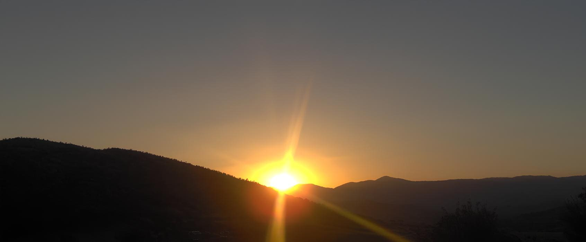

## 

#  Merhaba / Hi there 👋

---

## 🌟 GitHub Stats

  
  

---

## 📖 Hakkımda

- 🌐 Yaşanabilir bir kainat/dünya geleceği için Sevgiyle Yaşayın-Yaşatın,Okuyun-Okutun ve Paylaşın.

---

## 🚀 Açık Kaynak Katkıları

Şunlara katkıda bulundum:(sonra ekleneccek)

- [**go-..../....**](https://github.com/....)

---

## 👥 Ulaşın

- 🔘 Mastodon: [@usu@qoto.org](https://qoto.org/@usu)
- 🌐 Website: [netiz.me](https://netiz.me/)

İşbirliği, geri bildirim veya sadece merhaba demek için çekinmeden ulaşınız.

---

## Teknolojiler ve Araçlar

 
  
  

---

⭐ Ziyaret ettiğiniz için teşekkürler! 

> "karekod,barkod,kategoriler ve etiketler yokken insanlığın kavim bilge geçmişi vardı." – Ümit Solmaz
